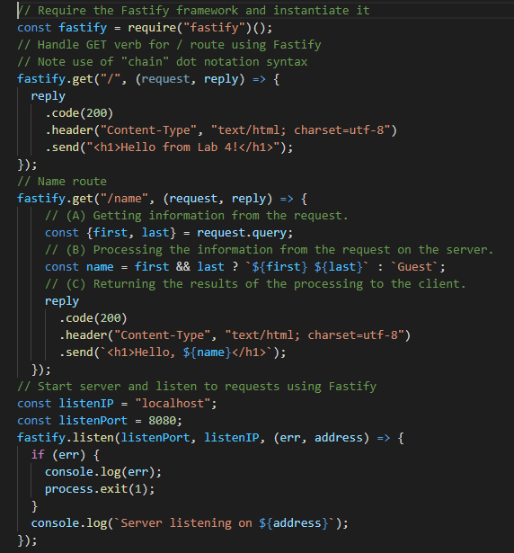

## Purpose

- Create a Fastify Node.js web server using Visual Studio Code (VSCode)
- Using Visual Studio Code (VSCode) terminal add git repo, exclude node_modules folder from git, and make commits
- Run and debug to fix MIME error, test, and commit
- Create a route with query parameters, test, and commit

[file for the server-code](lab-04.js)

